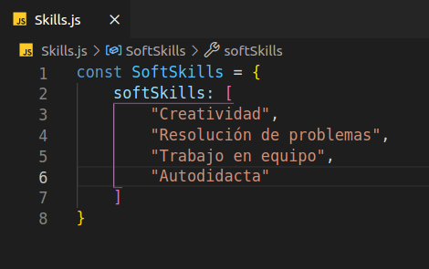

### Hola!! 👋

### 
Me llamo Jesuan Patermina y soy un Full Stack Developer 🚀
  

  

- 🔭 En este momento estoy ampliando mi experiencia y habilidades para conseguir mi primer trabajo en el mundo de la programación.
  
- 🌱 Actualmente estoy aprendiendo a utilizar firebase.

  
 

<h2>Skills</h2>

   
 <h2>Soft-Skills</h2>

   

## Contáctame

  

  
  

  
